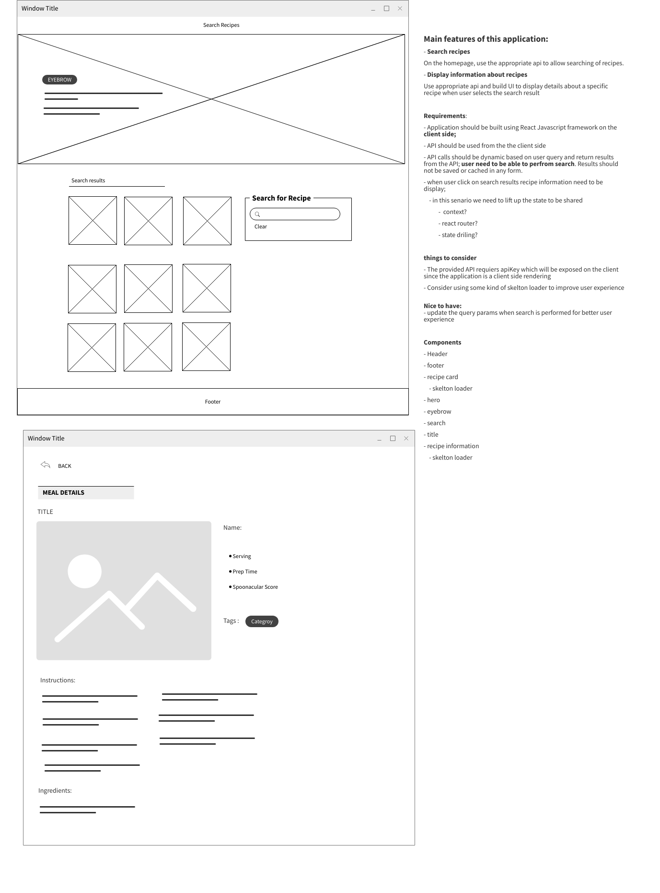

# Recipes Search App

This Recipes Search App allows users to search for recipes using the Spoonacular API. It
provides a user-friendly interface to discover and explore a wide variety of recipes.

## Features

- Search for recipes by keywords
- View detailed information about each recipe, including ingredients, instructions, and
  nutritional facts.

# Getting Started

This project was bootstrapped with
[Create React App](https://github.com/facebook/create-react-app).

### Prerequisites

Before you begin, ensure you have the following installed:

- Node.js: [Download and install Node.js](https://nodejs.org/)

### Installation

1. Clone the repository:

   ```bash
   git clone https://github.com/MohammadSheadeh/recipes-search-app.git
   cd recipes-search-app
   ```

2. Select the desired Node.js version
   ```bash
   nvm use
   ```
- nvm: [Installing and Updating](https://github.com/nvm-sh/nvm#installing-and-updating)

3. Install dependencies:
   ```bash
   npm ci
   ```

3. To add your api key; navigate to `src/constants/apis.ts` and include the api key

## Available Scripts

In the project directory, you can run:

### `npm start`

Runs the app in the development mode.\
Open [http://localhost:3000](http://localhost:3000) to view it in the browser.

The page will reload if you make edits.\
You will also see any lint errors in the console.

### `npm run format`

Prettier is used for code formatting. To ensure consistent formatting throughout the project.\
This command will automatically format the code based on the rules defined in the .prettierrc configuration
file.

### `npm test`

Launches the test runner in the interactive watch mode.\
See the section about [running tests](https://facebook.github.io/create-react-app/docs/running-tests)
for more information.

#### `npm run coverage`

Launches the test runner in the interactive watch mode to measure code coverage.\
See the section about [coverage reporting](https://create-react-app.dev/docs/running-tests/#coverage-reporting)
for more information.

### `npm run build`

Builds the app for production to the `build` folder.\
It correctly bundles React in production mode and optimizes the build for the best performance.

The build is minified and the filenames include the hashes.\
Your app is ready to be deployed!

See the section about [deployment](https://facebook.github.io/create-react-app/docs/deployment)
for more information.

### `npm run eject`

**Note: this is a one-way operation. Once you `eject`, you can’t go back!**

If you aren’t satisfied with the build tool and configuration choices, you can `eject` at any
time. This command will remove the single build dependency from your project.

Instead, it will copy all the configuration files and the transitive dependencies (webpack,
Babel, ESLint, etc) right into your project so you have full control over them. All of the
commands except `eject` will still work, but they will point to the copied scripts so you can
tweak them. At this point you’re on your own.

You don’t have to ever use `eject`. The curated feature set is suitable for small and middle
deployments, and you shouldn’t feel obligated to use this feature. However we understand that
this tool wouldn’t be useful if you couldn’t customize it when you are ready for it.

### Other Information



## Learn More

You can learn more in the
[Create React App documentation](https://facebook.github.io/create-react-app/docs/getting-started).

To learn React, check out the [React documentation](https://reactjs.org/).
